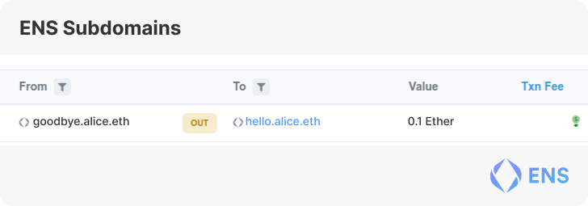

<Section name="1. Introduction" description="Introduction to ENS">

## What is ENS

The way we interact with most things on-chain is through the use of our addreses.

The Ethereum Name Service (ENS) is a distributed, open, and extensible naming system based on the Ethereum blockchain.

ENS's job is to map human-readable names like 'alice.eth' to machine-readable identifiers such as Ethereum addresses, other cryptocurrency addresses, content hashes, and metadata.

ENS also supports 'reverse resolution', making it possible to associate metadata such as canonical names or interface descriptions with Ethereum addresses.

However ENS provides tons of cool functionality, this guide will focus on integrating Username and Avatar resolution in your dApp.

## ENS Registration

Names can be registered through the [ENS Manager](https://app.ens.domains/), third-party applications (such as [ENS Fairy](https://ensfairy.xyz/), [Coinbase](https://www.coinbase.com/), or [Rainbow](https://rainbow.me/)), or directly on-chain.

<Quiz id={"???"} />

ENS Allows you to use human-readable names like 'alice.eth' in place of machine-readable identifiers
- True [✅]
- False

</Section>

<Section name="2. Functionality Overview" description="Understanding everything your ENS is capable of">

## Name Resolution

At its core ENS allows us to convert a human-readable name like **nick.eth** into a machine-readable address such as **0xb8c2C29ee19D8307cb7255e1Cd9CbDE883A267d5**. This is generally referred to as **forwards resolution**.

The most common place you will notice your own ENS name is in dApps. Due to the Primary Name (aka **reverse resolution**) abilities of the ENS contracts dApps can fetch a user's primary name and show this in their interface. This allows us to give users the same profile across the entire ecosystem.


## Subdomains & Custom Resolver

ENS allows users to write their own resolver in the form of a smart contract. You can extend the behaviour of domains by altering the **Resolver** field of your domain and pointing it towards your smart contract. This means you could write your own logic to control records, subdomains, and do all sorts of things like assign subdomains to NFT holders, or anything you could image. Read more about [writing your own resolver](https://docs.ens.domains/contract-developer-guide/writing-a-resolver).



## Internet Domain Compatability

In addition to the smart contract powered **.eth** TLD, the ENS smart contracts allow for any Internet Domain (.com, .net, .org, etc) to be used as an ENS Name through the use of our DNSSEC Integration. Read more about [ID Compatability](https://docs.ens.domains/dns-registrar-guide).


## Offchain Data

With the recent implementation of CCIP Read (Also known as [EIP-3668](https://eips.ethereum.org/EIPS/eip-3668)) we are able to read data from other chains or from other external locations. This enables us to have name information controlled by for example layer 2's, rollups, other chains, and centralized servers. More information about ENS and L2 Support can be found in the [ENS Layer2 and offchain data support
](https://docs.ens.domains/dapp-developer-guide/ens-l2-offchain).


## Question

<Quiz id={"???"} />

ENS is compatible with DNS adding functionality to Internet Domains.
- True [✅]
- False

<Quiz id={"???"} />

Which statement is correct?
- ENS allows for multi-chain address and Offchain resolution [✅]
- ENS only works with Ethereum Addresses and data on Ethereum

</Section>

<Section name="3. Registering an ENS" description="Getting your ">

## How to register
Registering your first ENS name is super easy through the use of the [ENS Manager](http://app.ens.domains/).


Once you arrive at the name's page and the name is available. (Checkout the **register** tab). You should see a live calculation of the costs for registering that name. Names with fewer then 5 characters, and recently expired names have different costs. For more information on registration costs, check our [FAQ](https://docs.ens.domains/permanent-registrar-faq#how-much-will-the-yearly-renewals-cost).


Once you click the **Request to Register** button and confirm the transaction the manager will reserve the name for you. After this you will need to wait for one minute. This is done to protect you from frontrunning and ensures you get the name you desired.


Great! Our name is now reserved for our second transaction. You can now click the **Register** button to complete the registration process.


**Congratulations!** 🎉 You now own an ENS name! To set it as your **Primary Name** click the **"Set As Primary ENS Name"** button and follow the steps.

## How to set Avatar

To set your avatar you can go to the [ENS Manager](https://app.ens.domains/) and select the name you would like to set an **Avatar** for.

Now you are on the page simply hit **ADD/EDIT RECORD** and scroll down to the **avatar** field.


### The Avatar Field

The Avatar Field can be filled with a variety of different types of text. In the example below I am uploading an **IPFS** link (using **ipfs://**), however you could also use **Arweave**, a link to an NFT (using [CAIP-29](https://github.com/ChainAgnostic/CAIPs/blob/master/CAIPs/caip-29.md)), base64 image, or any regular **HTTP(S)** url will do.


### Question

<Quiz id={"???"} />

Jimmy Fallon (fallon.eth) has an NFT from what collection as his profile picture?
- Bored Ape Yacht Club [✅]
- Cryptopunks
- Mutant Ape Yacht Club
- CryptoKitties

<Quiz id={"???"} />

ENS Domains are controlled by smart contracts and registration is stored on chain.
- True [✅]
- False

</Section>

<Section name="4. Integrate ENS" description="Integrate ENS into your Project">

## Resolving ENS names for Users

With the help of your favourite library such as [Ethers](https://docs.ethers.io/v5/api/providers/provider/#Provider--ens-methods), [Wagmi](https://wagmi.sh/docs/hooks/useEnsName), [ENS.js](https://www.npmjs.com/package/@ensdomains/ensjs), [Web3.js](https://web3js.readthedocs.io/en/v1.2.0/web3-eth-ens.html), [Web3j](https://github.com/web3j/web3j), [KEthereum](https://github.com/komputing/KEthereum/tree/master/ens), [web3.py](https://web3py.readthedocs.io/en/stable/ens_overview.html), [go-ens](https://github.com/wealdtech/go-ens), and many more.


It's that easy! Now your dApp is ready to show everyone's names everywhere! And don't forget to fallback to addresses when the user doesn't have a name.

#### React Example

Below is an example snippet of what this would look like using [wagmi](https://wagmi.sh/docs/hooks/useEnsName).

```tsx
import { useAccount, useEnsAvatar, useEnsName } from 'wagmi';

const shortenAddress = (address) => `${address.substr(0, 5)}...${address.substr(-4)}`;

export const UserProfile = () => {
    const { address } = useAccount();
    const { data: name, isSuccess: isNameSuccess } = useEnsName({ address });
    const { data: avatar, isSuccess: isAvatarSuccess } = useEnsAvatar({
        addressOrName: address,
    });

    return (
        <div>
            <div>
                {isAvatarSuccess && avatar ? (
                    
                ) : (
                    
                )}
            </div>
            <div>
                {isNameSuccess && name ? (
                    <div>
                        <span>{name}</span>
                        <span>{shortenAddress(address)}</span>
                    </div>
                ) : (
                    <div>{address}</div>
                )}
            </div>
        </div>
    );
};
```

## Retrieving Address from Name

You may however want users to be able to search for each other, mention one another, or even challenge each other to a game of tic tac to. Now should this be the case there is the **resolveName** functionality that allows you to enter any valid ENS name and get back the address.


## Question

<Quiz id={"???"} />

What address does vitalik.eth resolve to?
- 0xd8da6bf26964af9d7eed9e03e53415d37aa96045 [✅]
- 0xb8c2c29ee19d8307cb7255e1cd9cbde883a267d5
- 0x225f137127d9067788314bc7fcc1f36746a3c3b5
- 0x5a384227b65fa093dec03ec34e111db80a040615

</Section>

<Section name="Dev Resources" description="Developer Resources">

## ENS Developer Resources

### [Quickstart](https://docs.ens.domains/dapp-developer-guide/ens-enabling-your-dapp)

Everything you need to know to get started implementing ENS in your dApp.

### [Docs](https://docs.ens.domains)

Your go-to location for protocol information and examples.

### [Metadata Service](https://metadata.ens.domains/docs)

Metadata service that allows for fetching data .

### [Libraries](https://docs.ens.domains/dapp-developer-guide/ens-libraries)
- [Ethers](https://docs.ethers.io/v5/api/providers/provider/#Provider--ens-methods)
- [Wagmi](https://wagmi.sh/docs/hooks/useEnsName)
- [ENS.js](https://www.npmjs.com/package/@ensdomains/ensjs)
- [Web3.js](https://web3js.readthedocs.io/en/v1.2.0/web3-eth-ens.html)
- [Web3j](https://github.com/web3j/web3j)
- [KEthereum](https://github.com/komputing/KEthereum/tree/master/ens)
- [web3.py](https://web3py.readthedocs.io/en/stable/ens_overview.html)
- [go-ens](https://github.com/wealdtech/go-ens)

### [Mirror](https://ens.mirror.xyz/)

For the latest news and updates about the ENS Ecosystem.

### [Medium](https://medium.com/the-ethereum-name-service)

For our archive of Articles.


</Section>
