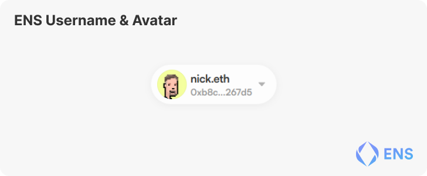
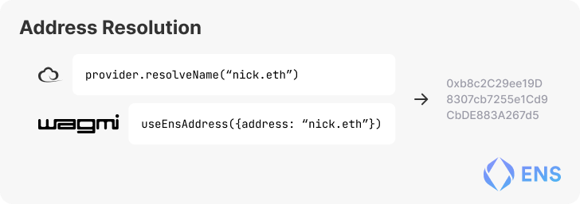

# Intro to Ethereum Name Service

## 1. Introduction

### What is ENS

The way we interact with most things on-chain is through the use of our addreses.

The Ethereum Name Service (ENS) is a distributed, open, and extensible naming system based on the Ethereum blockchain.

ENS's job is to map human-readable names like 'alice.eth' to machine-readable identifiers such as Ethereum addresses, other cryptocurrency addresses, content hashes, and metadata.

ENS also supports 'reverse resolution', making it possible to associate metadata such as canonical names or interface descriptions with Ethereum addresses.

However ENS provides tons of cool functionality, this guide will focus on integrating Username and Avatar resolution in your dApp.

### ENS Registration

Names can be registered through the [ENS Manager](https://app.ens.domains/), third-party applications (such as [ENS Fairy], [Coinbase](https://www.coinbase.com/), or [Rainbow](https://rainbow.me/)), or directly on-chain.

<Quiz id={"???"} />

ENS Allows you to use human-readable names like 'alice.eth' in place of machine-readable identifiers
- True [✅]
- False

## 2. Functionality Overview

### Name Resolution

The most common use-case of ENS is found in the dApp space. Due to the `reverse resolution` abilities of the ENS contract dApps can fetch a user's preferred ENS name and show this in their interface.

### Subdomains

ENS allows subdomains to be created and distributed as NFTs and controlled by smart contracts. You can extend the behaviour of domains by altering the `Resolver` field of the domain and pointing it towards your smart contract. Read more about [writing your own resolver](https://docs.ens.domains/contract-developer-guide/writing-a-resolver)

### Internet Domain Compatability

In addition to the smart contract powered `.eth` TLD, the ENS smart contracts allow for any Internet Domain (.com, .net, .org, etc) to be used as an ENS Name through the use of our DNSSEC Integration. Read more about [ID Compatability](https://docs.ens.domains/dns-registrar-guide).

For a list of all DNSSEC Enabled 

### Offchain Data

With the recent implementation of CCIP Read (Also known as [EIP-3668](https://eips.ethereum.org/EIPS/eip-3668) or 'durin') we are able to read data from other chains or from other external locations. This enables us to have name information controlled by for example layer 2's, rollups, other chains, and centralized servers. More information about ENS and L2 Support can be found in the [ENS Layer2 and offchain data support
](https://docs.ens.domains/dapp-developer-guide/ens-l2-offchain).

### Question

<Quiz id={"???"} />

Insert control question about ENS here
- Answer 1[✅]
- Answer 2
- Answer 3
- Answer 4

<Quiz id={"???"} />

Insert control question about ENS here
- Answer 1[✅]
- Answer 2
- Answer 3
- Answer 4

## 3. Integrate ENS

### Resolving ENS names for Users

With the help of your favourite library such as [Ethers](https://docs.ethers.io/v5/api/providers/provider/#Provider--ens-methods), [Wagmi](https://wagmi.sh/docs/hooks/useEnsName), [ENS.js](https://www.npmjs.com/package/@ensdomains/ensjs), [Web3.js](https://web3js.readthedocs.io/en/v1.2.0/web3-eth-ens.html), [Web3j](https://github.com/web3j/web3j), [KEthereum](https://github.com/komputing/KEthereum/tree/master/ens), [web3.py](https://web3py.readthedocs.io/en/stable/ens_overview.html), [go-ens](https://github.com/wealdtech/go-ens), and many more.

It's that easy! Now your dApp is ready to show everyone's names everywhere! And don't forget to fallback to addresses when the user doesn't have a name.

### Retrieving Address from Name

You may however want users to be able to search for eachother, mention one another, or even challenge eachother to a game of tic tac to. Now should this be the case there is the `resolveName` functionality that allows you to enter any valid ENS name and get back the address.

### Question

<Quiz id={"???"} />

Insert control question about ENS here
- Answer 1[✅]
- Answer 2
- Answer 3
- Answer 4

<Quiz id={"???"} />

Insert control question about ENS here
- Answer 1[✅]
- Answer 2
- Answer 3
- Answer 4

</Section>

## Dev Resources

### ENS Developer Resources

#### [Docs](https://docs.ens.domains)

Your go-to location for protocol information and examples.

#### [Libraries](https://docs.ens.domains/dapp-developer-guide/ens-libraries)
- [Ethers](https://docs.ethers.io/v5/api/providers/provider/#Provider--ens-methods)
- [Wagmi](https://wagmi.sh/docs/hooks/useEnsName)
- [ENS.js](https://www.npmjs.com/package/@ensdomains/ensjs)
- [Web3.js](https://web3js.readthedocs.io/en/v1.2.0/web3-eth-ens.html)
- [Web3j](https://github.com/web3j/web3j)
- [KEthereum](https://github.com/komputing/KEthereum/tree/master/ens)
- [web3.py](https://web3py.readthedocs.io/en/stable/ens_overview.html)
- [go-ens](https://github.com/wealdtech/go-ens)

Your Favourite Libraries

#### [Mirror](https://ens.mirror.xyz/)

For the latest news and updates about the ENS Ecosystem.

#### [Medium](https://medium.com/the-ethereum-name-service)

For our archive of Articles.

