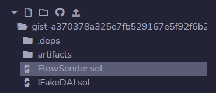
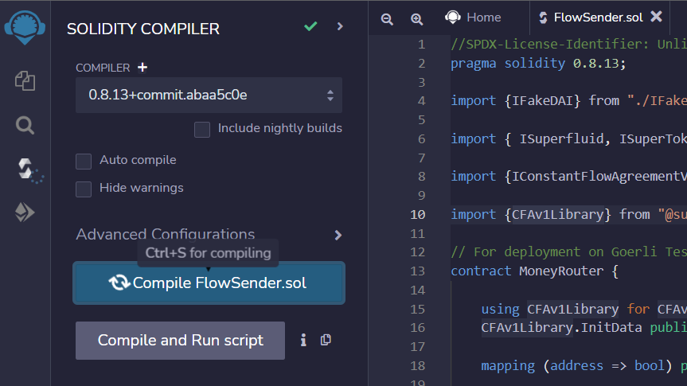
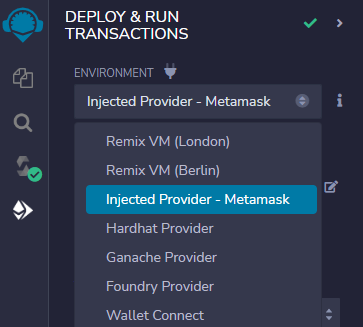
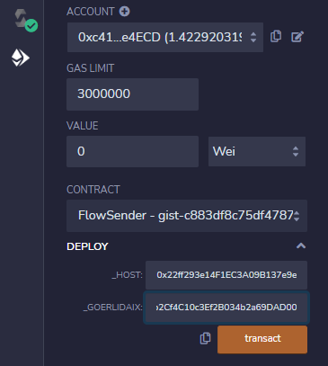

# Streaming Money in Solidity

[Docs Reference Page](https://docs.superfluid.finance/superfluid/developers/solidity-examples/solidity-libraries/cfav1-library)

So you've seen how easy it is to stream straight from your EOA account (your plain personal wallet) using the SDK Core. Now, say you want to create a smart contract that will be able to stream tokens on its own. 

You've probably seen a contract transfer ERC20 tokens on its own with the transfer function 👇

```
IERC20(tokenAddress).transfer(receiverAddress, amountToTransfer);
```

Well, here's the equivalent for a contract streaming Super Tokens on its own 👇 It's not rocket science!

```
cfaV1.createFlow(receiverAddress, superToken, perSecondflowRate);
```

However, there is some set up needed before hand in order for your contract to begin streaming money like that - read on!

# Basic Example - FlowSender Contract

To illustrate how a contract can send money in streams, we'll use a simple contract which we'll call the FlowSender. Basically, FlowSender is going to fund itself with fDAIx and be able to create, update, and delete streams to addresses of our choosing.

Click on this [**REMIX IDE**](https://remix.ethereum.org/?#gist=c883df8c75df47870bc23c1a11d3e36a&version=soljson-v0.8.13+commit.abaa5c0e.js) link to find the FlowSender contract. Note that the IDE will open all the environment folders at once; you can close them such that the file directory looks like this:



Let's get walk through some of the code real quick!

## 1. Superfluid Set Up

First, we make these imports which are needed for setting up the contract to interact with the Superfluid Protocol:

```

import { ISuperfluid, ISuperToken } from "@superfluid-finance/ethereum-contracts/contracts/interfaces/superfluid/ISuperfluid.sol";

import {IConstantFlowAgreementV1} from "@superfluid-finance/ethereum-contracts/contracts/interfaces/agreements/IConstantFlowAgreementV1.sol";

import {CFAv1Library} from "@superfluid-finance/ethereum-contracts/contracts/apps/CFAv1Library.sol";

```

Then, we set up the CFA Library with these two bits of code in the contracts:

```
using CFAv1Library for CFAv1Library.InitData;
CFAv1Library.InitData public cfaV1;               //initialize cfaV1 variable
```
and in the constructor:
```
//initialize InitData struct, and set equal to cfaV1        
cfaV1 = CFAv1Library.InitData(
    _host,
    //here, we are deriving the address of the CFA using the host contract
    IConstantFlowAgreementV1(
        address(_host.getAgreementClass(
                keccak256("org.superfluid-finance.agreements.ConstantFlowAgreement.v1")
            ))
    )
);
```
To learn more about these instantiations, feel free to reference [here](https://docs.superfluid.finance/superfluid/developers/solidity-examples/solidity-libraries/cfav1-library#initializing-the-library) in our docs.

## 2. Getting the contract some Super Tokens

This is done by calling `gainDaiX`. Basically, this function mints the FlowSender contract 10,000 fDAI and wraps it into fDAIx.

fDAIx is a [wrapper Super Token](https://docs.superfluid.finance/superfluid/protocol-overview/in-depth-overview/super-tokens#wrapper). Its underlying token is fake DAI (fDAI).

fDAI has a public mint function which lets anyone mint their own fDAI whenever they want. Makes life easy for this tutorial!

```
function gainDaiX() external {

    // Get address of fDAI by getting underlying token address from DAIx token
    IFakeDAI fdai = IFakeDAI( goerliDaiX.getUnderlyingToken() );
    
    // Mint 10,000 fDAI
    fdai.mint(address(this), 10000e18);

    // Approve fDAIx contract to spend fDAI
    fdai.approve(address(goerliDaiX), 20000e18);

    // Wrap the fDAI into fDAIx
    goerliDaiX.upgrade(10000e18);

}
```

## 3. Creating a stream!

Here's how we get the contract to send a stream of fDAIx with `createStream`.

```
function createStream(int96 flowRate, address receiver) external {

    // Create stream
    cfaV1.createFlow(receiver, goerliDaiX, flowRate);

}
```

## 4. Compile and Deploy the Contract

**Head to the Compile tab to compile the FlowSender contract**



**Make sure your Metamask is connected to Goerli Testnet and switch the Environment to `Injected Provider - Metamask`**



**Head to the Deploy tab and deploy the contract with the following parameters:**

You can find these addresses in our docs [here](https://docs.superfluid.finance/superfluid/developers/networks#test-networks).

The address of the Superfluid Host contract on Goerli Testnet

`_HOST` - 0x22ff293e14F1EC3A09B137e9e06084AFd63adDF9

The address of fDAIx (the wrapper Super Token for a free mintable fDAI token) on Goerli Testnet

`_GOERLIDAIX` - 0xF2d68898557cCb2Cf4C10c3Ef2B034b2a69DAD00

